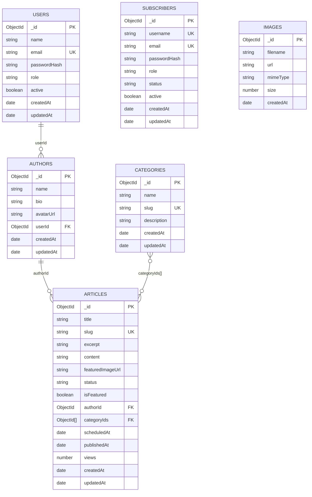

# Base de datos (Mermaid)

Diagrama ER basado en los modelos de `src/modules`.

Notas:
- `featuredImageUrl` en `ARTICLES` es una URL (no FK directa a `IMAGES`).
- `USERS` y `SUBSCRIBERS` son colecciones separadas para sesiones/admin y lectores.

