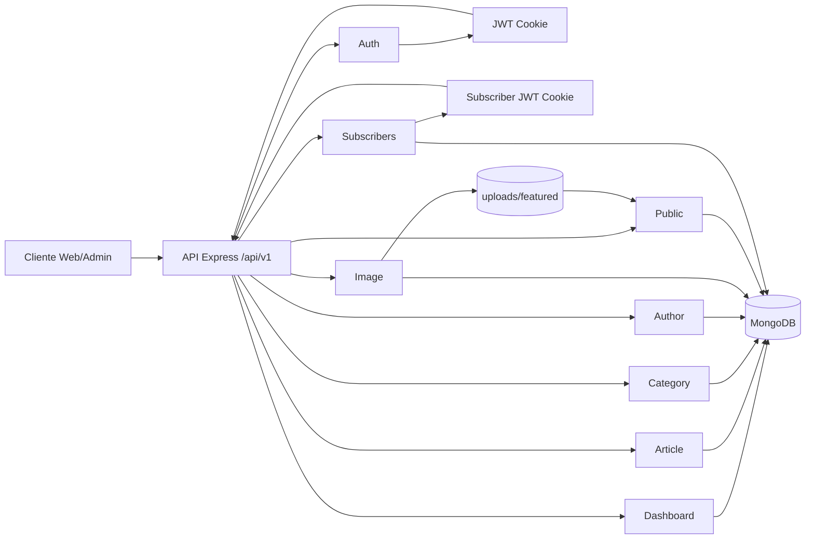
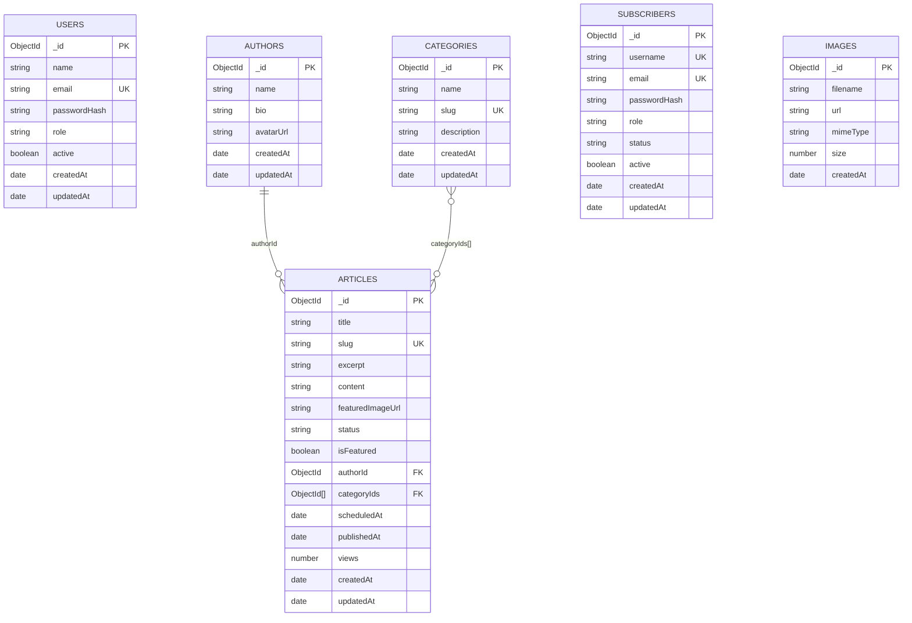

# Endpoints · Entrada de documentación

Este archivo es el **índice principal** para pruebas manuales de la API.

## Módulos

- [Auth](./src/modules/auth/all.md)
- [Dashboard](./src/modules/dashboard/all.md)
- [Article](./src/modules/article/all.md)
- [Category](./src/modules/category/all.md)
- [Author](./src/modules/author/all.md)
- [Image](./src/modules/image/all.md)
- [Public](./src/modules/public/all.md)
- [Subscribers](./src/modules/subscribers/all.md)

## Flujo de datos (Mermaid)

## Relaciones de base de datos (Mermaid)

## Cómo usar esta documentación

1. Empieza por el módulo que vas a probar desde la lista anterior.
2. Usa su `all.md` como guía de endpoints, payloads y respuestas esperadas.
3. Para pruebas con sesión/token, autentícate primero en **Auth** y reutiliza credenciales en el resto de módulos.
4. Prueba flujo feliz + errores comunes (validación, permisos, recursos inexistentes).
5. Si cambias un endpoint, actualiza primero su `all.md` del módulo y deja este archivo como índice.
